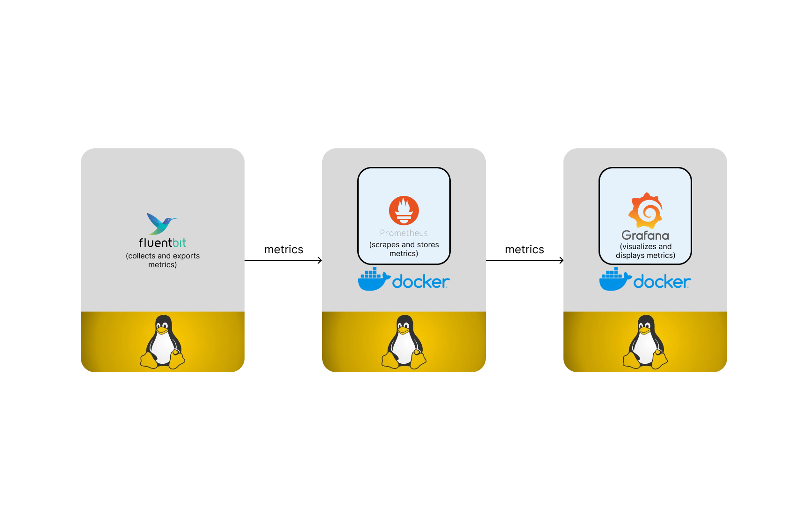

# Linux VM Monitoring System
## Goal:
Gain observability into a Linux virtual machine (VM) by
1. collecting its metrics with [Fluent Bit](https://fluentbit.io/)
2. writing them to [Prometheus](https://prometheus.io/)
3. displaying them in [Grafana](https://grafana.com/).

Here're the metrics we'd like to collect from the Linux machine. According to Fluent Bit's [offical documentation on the Node Exporter Metrics input plugin](https://docs.fluentbit.io/manual/pipeline/inputs/node-exporter-metrics), we can collect the following:
- `cpu`: Exposes CPU statistics.
- `diskstats`: Exposes disk I/O statistics.
- `meminfo`: Exposes memory statistics.
- `netdev`: Exposes network interface statistics such as bytes transferred.
- `uname`: Exposes system information as provided by the uname system call.

## Design (subject to change):


## Prerequisites:
- macOS: Sequoia (Version 15.1.1)
- Docker Desktop (Version 4.37.1)

## Setup instructions:
1. Clone this GitHub repository:
   ```bash
   git clone git@github.com:shilongjaycui/linux-vm-monitoring-system.git
   ```
2. Navigate into the cloned repository:
   ```bash
   cd linux-vm-monitoring-system
   ```
3. 

## Next steps:
- Create the VMs using Terraform (infrastructure as code)
- Make the monitoring system usable in both AWS and GCP